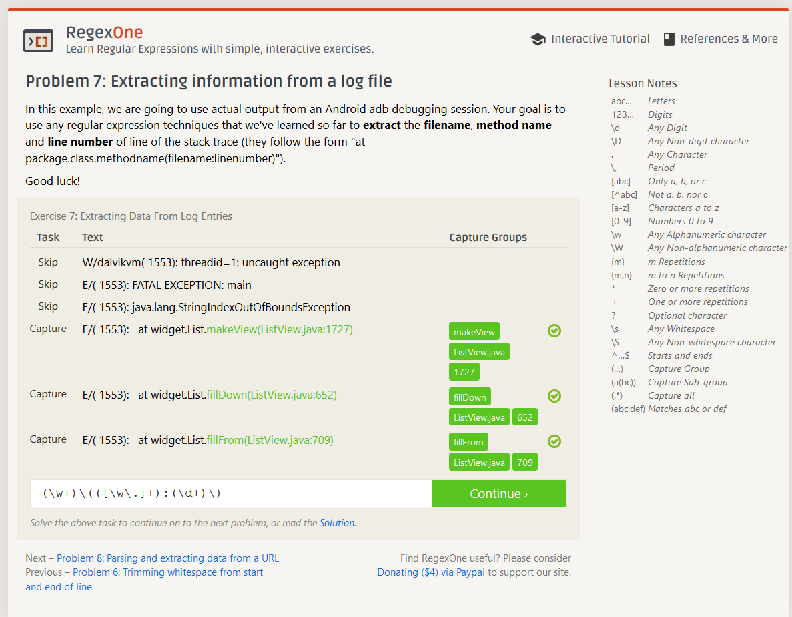

# Lab 01 Report - Introduction to Open Source Software

## Name: Zachary Koo - 
### email: kooz2@rpi.edu
### github account: https://github.com/iKoogar
### discord handle: koog#0005
### me: 
### discord screenshot: 

## 2. Reading assignments

##### The Open Source Definition illustrates what is necessary for a piece of software to be open-source. Having a project be open-source is important because, among other things, it can be developed by and used by anyone, meaning that bugs can be found more easily, and other projects can incorporate your project into theirs to save time and effort. 

##### "Smart Questions" was an excellent read for me, personally, because I really do not enjoy being asked terrible questions. This article seems like it was created by the same people that made "Let me Google that for you". 

##### How to answer questions in a smart way : From my experience (reading answers on stackoverflow), if you know that the question has already been answered elsewhere, linking the location of the answer is very helpful to the person who asked and anyone else looking for the answer in the future. Additionally, some people are unaware that their questions are low effort or just very bad. Sometimes informing the person who asked the bad question that their question should have had more thought before hand could have positive results. 

## 3. Free Culture

##### Reading stories like Jesse's outlines the stark differences between lawmaking and technology. I would imagine that the laws that were written that charge an individual $150,000 for the illegal distribution of a song were not written when it was possible to distribute thousands of them illegally at the same time, but I could be wrong. This situation reminds me of the issues with copyright claims that were happening more recently on sites like youtube.com and twitch.tv. Many content createors were upset that their content was being taken down because there was copyrighted music in it. Again, I imagine that many copyright laws were written before any person was able to stream the copyrighted music to potentially millions of people. On one hand, it may seem ridiculous that someone can't upload a video with some music that like 5 people will watch without worrying, but at the same time it isn't fair to the people who produced the music. Returning to Jesse's case, I think that the whole situation was very unfortunate for him, but it also illustrates the importance of being careful with the data that an application you build is handling. 

## 8. Tree screenshot: 

## 10. 7 problems:

## 11. 4 problems: 

## 13. maze: 

## 14. Open Source Project: Audacity

##### I wasn't really sure how to select an open source project so I went with the first one that I recognize and actually use from the list which was Audacity. Audacity is a free open source digital audio editor with many useful features. The first steps I would take to evaluating the project would be to compare it to the 10 criteria of open source. Reading up on its documentation, source code, and ability to make contributions to the project would be good metrics of determining how good the open-source project is. 