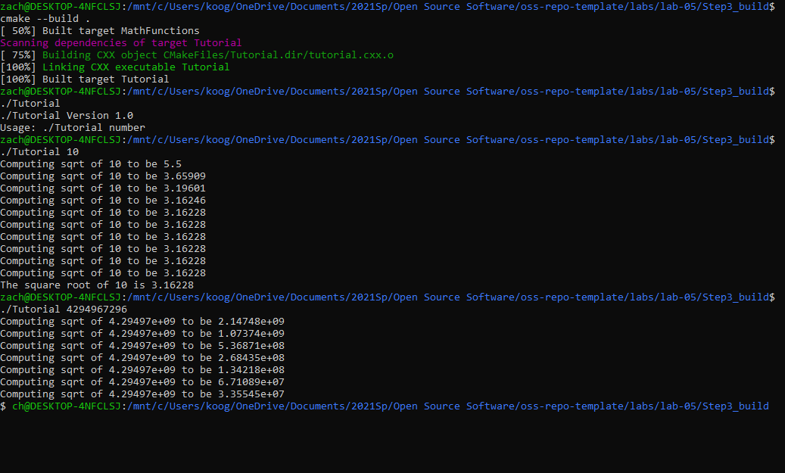

### part1: 
### part2: 
### part3: 
### part4: 
### part5: 

### makefile: https://github.com/iKoogar/oss-repo-template/blob/master/labs/lab-05/Lab-BuildSystemsExample/makefile.txt
### CMakeLists: https://github.com/iKoogar/oss-repo-template/blob/master/labs/lab-05/Lab-BuildSystemsExample/CMakeLists.txt
### comparison: https://github.com/iKoogar/oss-repo-template/blob/master/labs/lab-05/comparison.txt
