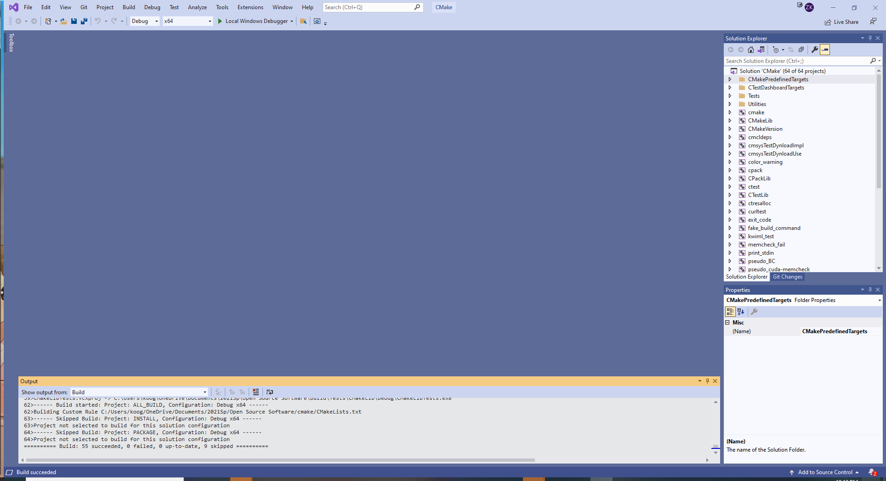
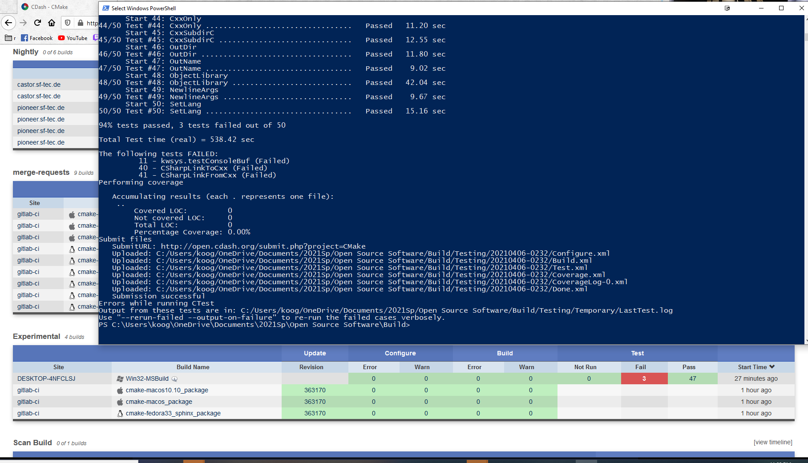
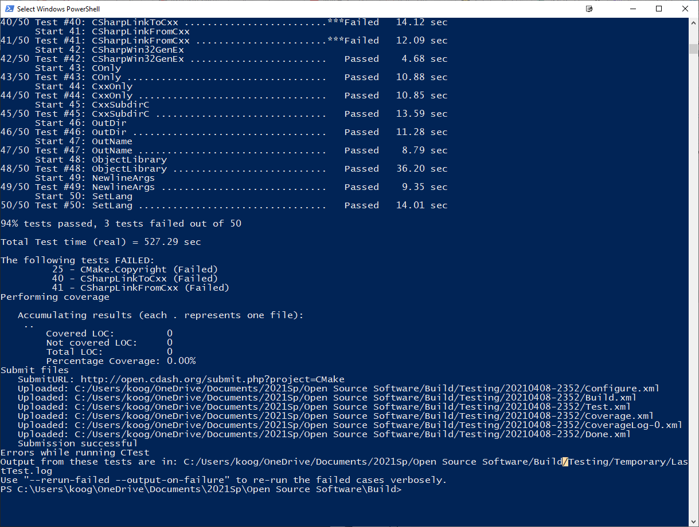
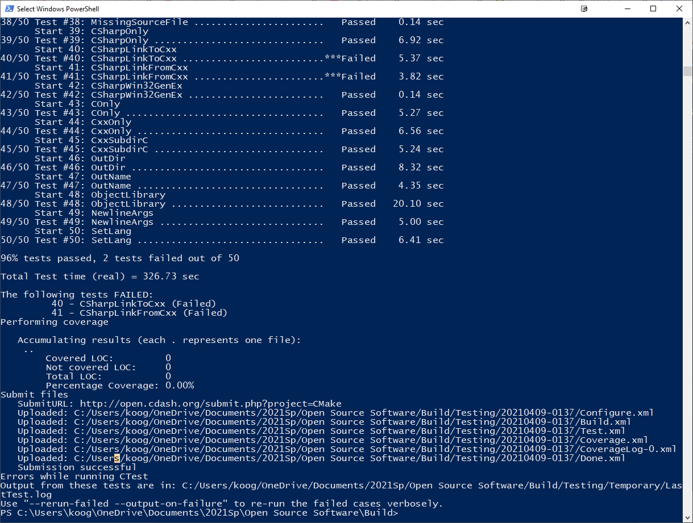

### Checkpoint 1: 

### Checkpoint 2: 
There were a couple of errors, but they seemed to be insignificant.

### Checkpoint 3: 
There is a new error - CMake.Copyright

Reverting the copyright file fixes the error

### Checkpoint 4: 