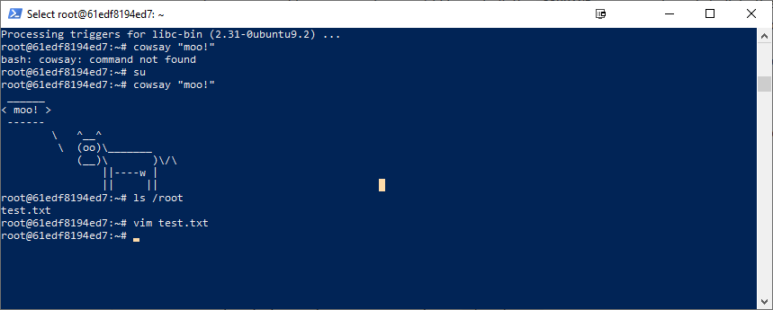

# Lab 08 Report - Open Source Software

## Name: Zachary Koo - 
### email: kooz2@rpi.edu
### github account: https://github.com/iKoogar

### Example 0: 
Installing docker was a bit of a pain because I had been using WSL 1 but after a bit of troubleshooting, everything worked as expected.

### Example 1: 
Following the directions led to the expected functionality and a cow saying "moo!"

### Example 2: 
I could not get rocket chat to appear locally for some reason. Despite the rocketchat and mongo containers clearly running on my machine, I was not able to view them in the mongo port. I even tried the default installation instructions [here](https://hub.docker.com/_/rocket-chat) and that didn't work either. 

### Example 3: 
Everything worked as expected. 

### Example 4: 
I struggled to view both the frontend and backend for this example. I attempted to change the port in the docker-compose.yml to see if changing the port to something other than 5000 would help, but that did not make a difference. 

