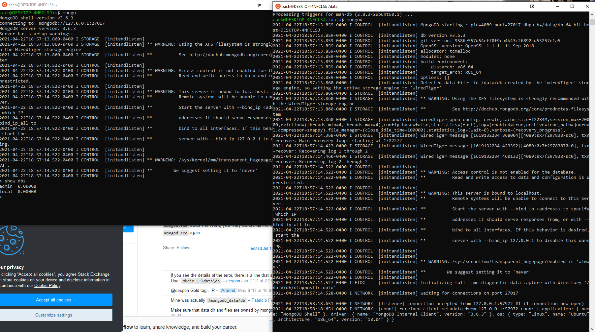
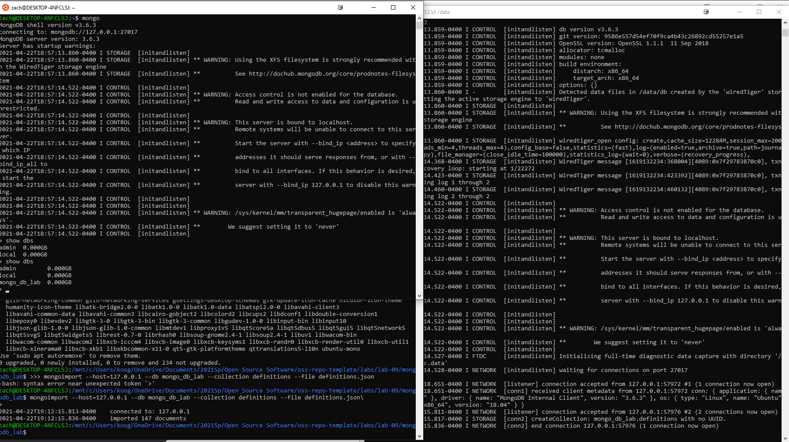
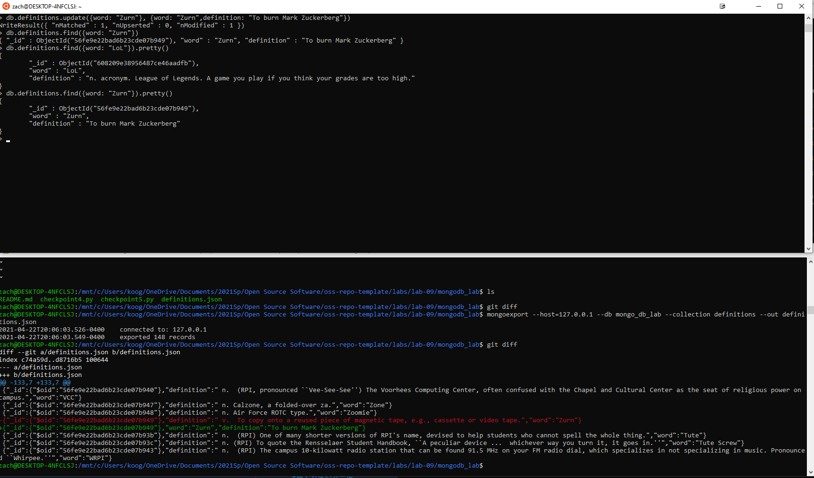
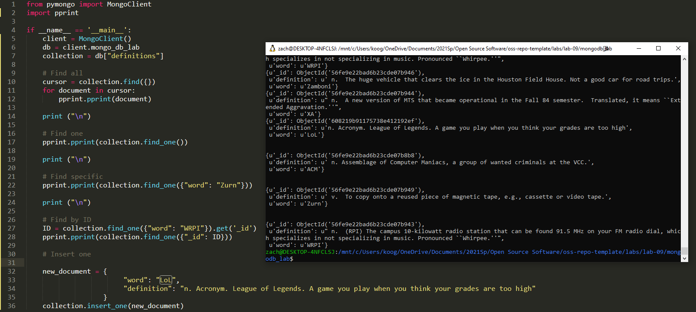
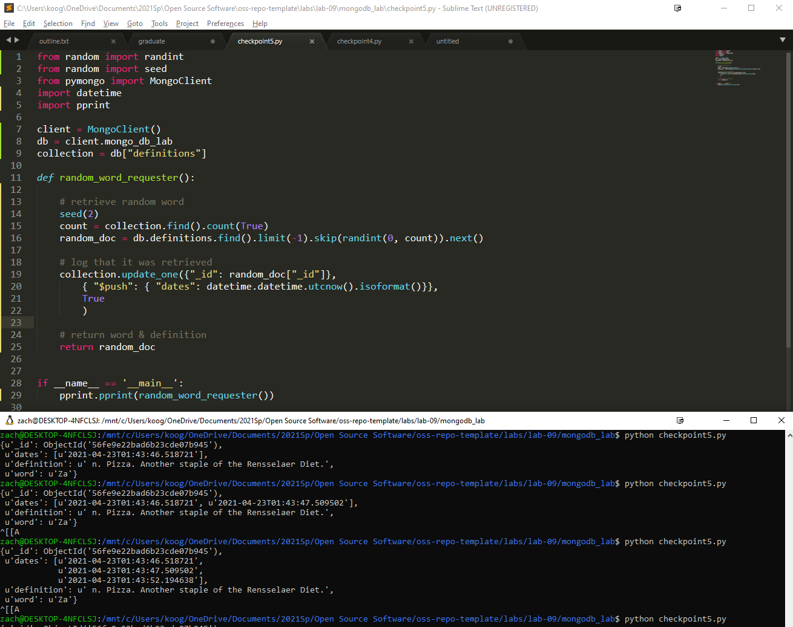

# Lab 09 Report - Open Source Software

## Name: Zachary Koo - 
### email: kooz2@rpi.edu
### github account: https://github.com/iKoogar

### Checkpoint 0: 
[Link to blog](https://rcos.io/projects/kevinb5617/resumake/blog)

### Checkpoint 1: 
MongoDB Installation: 


### Checkpoint 2: 
Database imported successfully


### Checkpoint 3: 
I added the word "LoL" and edited the word "Zurn". The added word "LoL" doesn't appear in the git diff because I accidentally ran git diff once before editing "Zurn".


### Checkpoint 4: 
```
from pymongo import MongoClient
import pprint

if __name__ == '__main__':
	client = MongoClient()
	db = client.mongo_db_lab
	collection = db["definitions"]

	# Find all
	cursor = collection.find({})
	for document in cursor:
		pprint.pprint(document)

	print ("\n")

	# Find one 
	pprint.pprint(collection.find_one())

	print ("\n")

	# Find specific
	pprint.pprint(collection.find_one({"word": "Zurn"}))

	print ("\n")

	# Find by ID
	ID = collection.find_one({"word": "WRPI"}).get('_id')
	pprint.pprint(collection.find_one({"_id": ID}))

	# Insert one

	new_document = {
						"word": "LoL",
						"definition": "n. Acronym. League of Legends. A game you play when you think your grades are too high"
				   }
	collection.insert_one(new_document)

```



### Checkpoint 5: 
```
from random import randint
from random import seed
from pymongo import MongoClient
import datetime
import pprint

client = MongoClient()
db = client.mongo_db_lab
collection = db["definitions"]

def random_word_requester():

    # retrieve random word
    count = collection.find().count(True)
    random_doc = db.definitions.find().limit(-1).skip(randint(0, count)).next()

    # log that it was retrieved
    collection.update_one({"_id": random_doc["_id"]}, 
    	{ "$push": { "dates": datetime.datetime.utcnow().isoformat()}},
    	True
    	)

    # return word & definition
    return random_doc


if __name__ == '__main__':
    pprint.pprint(random_word_requester())

```

